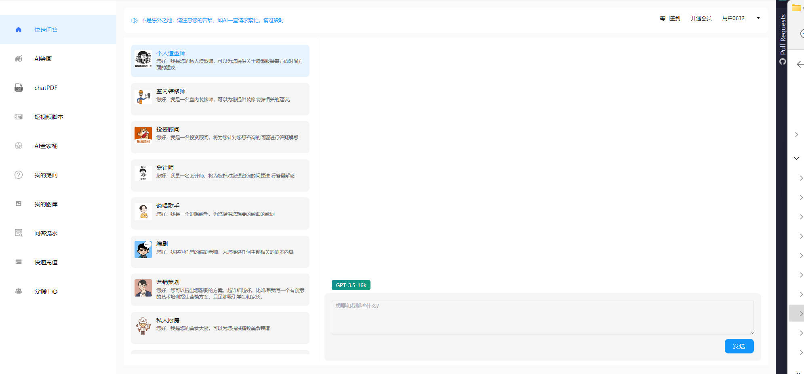

### [文档](https://www.kancloud.cn/momoyu/momoyu/3169622)  | [WEB演示](https://pc.momoyucm.top)
### 项目说明
- JAVA+vue+uni开发的chatgpt程序
- 开发脚手架基于人人开源 https://gitee.com/renrenio/renren-security
- java开发的chatgpt小程序  前端使用uniapp   可打包多端运行  APP  H5  公众号  小程序等 ,三级分销,卡密充值,提供opai的反向代理,
- 后台包括海报管理,充值配置管理,GPTKEY管理,用户管理,分销提现管理,问答模板配置,AI模配置等
- 基础的CHATPDF功能  会进一步完善这个
- 可使用三方转发的4.0，方便申请不下来官方key的使用
- WEB版本包括SD绘画,FS绘画等
- 接入三方内容检测功能,免得乱提问题坐牢去了
- 具体功能看演示(演示为商业版本)
- WEB演示地址：http://pc.zhuzaishuo.love
- H5演示地址：http://h5.zhuzaishuo.love 通过手机验证码，输入浏览器访问
- 有后台配置参数地址，如模型问答管理，海报设置，支付配置，提现管理，用户管理，卡密配置等等
<br>


**本地JAVA部署**
- 通过git下载源码
- idea、eclipse需安装lombok插件，不然会提示找不到entity的get set方法
- 创建数据库renren_security，数据库编码为UTF-8
- 执行renren-api/db/chatgpt.sql文件，初始化数据
- 后台管理默认账号密码为admin
- 修改application-dev.yml文件，更新MySQL账号和密码
- 运行后在后台管理-->系统设置-->参数管理对应修改公众号/小程序等APPID

**本地后台管理VUE运行**
- 您需要提前在本地安装[Node.js](https://nodejs.org/en/)，版本号为：[12.x、14.x]，再使用[Git](https://git-scm.com/)克隆项目或者直接下载项目后，然后通过`终端命令行`执行以下命令。

```bash
# 切换到项目根目录

# 安装插件
npm install

# 启动项目
npm run serve
```
**本地UNIAPP代码运行**
- 修改utils/evn.js中的BASE_URL为你的api地址
- 修改utils/evn.js中的BASE_WS为你的ws api地址
- 修改utils/request.js中的BASE_URL为你的api地址
- 修改manifest.json中的小程序appid
```bash
# 切换到项目根目录

# 安装插件
npm install
```
<br>

### 项目截图(截图内容为商业版本)
**WEB页面**



*手机端页面**


**后台页面**


### 普通版本与商业版的区别
|  功能    |  基础版本   |  商业版   |
| --- | --- | --- |
|   用户管理  |   ✅  |   ✅  |
|   热门问题  |   ✅  |   ✅  |
|   AI    问答  |   ✅  |   ✅  |
|   问答记录  |   ✅  |   ✅  |
|   GPTKEY管理  |   ✅  |   ✅  |
|   三端登入  |   ✅  |   ✅  |
|   WEB端页面  |   ❌  |   ✅  |
|   CHATPDF  |   ❌  |   ✅  |
|   三方4.0  |   ❌  |   ✅  |
|   3.5和4.0不用收费模式配置  |   ❌  |   ✅  |
|   提问模板  |   ❌  |   ✅  |
|   VIP充值  |   ❌  |   ✅  |
|   问答币充值  |   ❌  |   ✅  |
|   GPT绘画  |   ❌  |   ✅  |
|   三级分销  |   ❌  |   ✅  |
|   邀请海报  |   ❌  |   ✅  |
|   合伙人模式  |   ❌  |   ✅  |
|   支付宝充值  |   ❌  |   ✅  |
|   微信充值  |   ❌  |   ✅  |
|   卡密兑换 |   ❌  |   ✅  |
|   分销提现  |   ❌  |   ✅  |
|   问答内容检测  |   ❌  |   ✅  |
|   FS绘画 |   ❌  |   ✅  |
|   SD绘画  |   ❌  |   ✅  |
|   二开帮助  |   ❌  |   ✅  |
|   专业售后服务  |   ❌  |   ✅  |

<br>


### 详细可联系
VX:MYBMWUPUPUP

# chatgpt-java-vue
